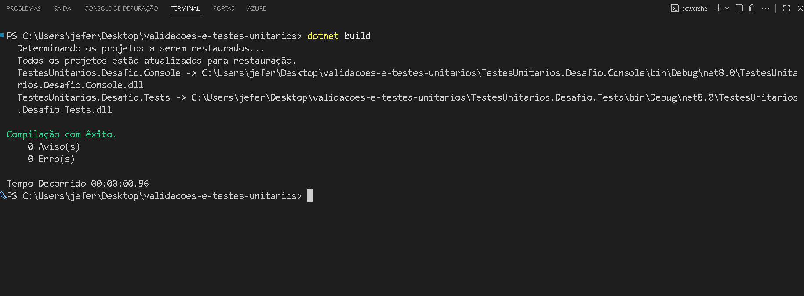
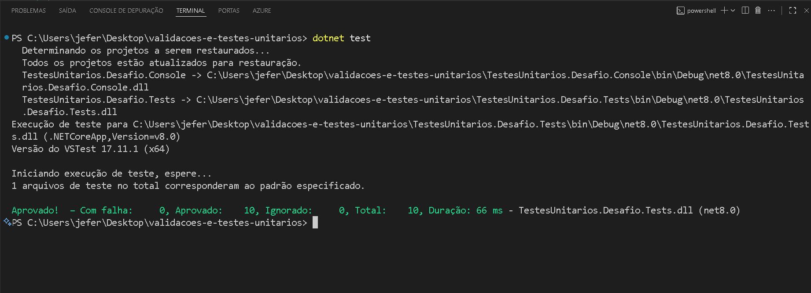

# Testes Unitários com C#

---

## Desafio de projeto
O objetivo deste desafio é aplicar conhecimentos adquiridos no módulo de Testes Unitários com C# da trilha .NET da DIO, garantindo a qualidade do código e prevenindo bugs em funcionalidades críticas do sistema

---

## Contexto
O sistema atual apresenta falhas recorrentes, como:

- Bugs inesperados

- Funcionalidades que deixam de funcionar

- Validações inconsistentes

Para aumentar a confiabilidade do software, a implementação de testes unitários foi sugerida. Esses testes cobrem cenários positivos e negativos, garantindo rastreabilidade e controle do código.

O desafio consiste em implementar os testes unitários das classes do projeto console, seguindo as regras definidas abaixo.

---

## Premissas
A solução possui dois projetos:

1- TestesUnitarios.Desafio.Console → projeto console, com as classes de lógica: ValidacoesLista e ValidacoesString.

2- TestesUnitarios.Desafio.Tests → projeto de testes usando xUnit, com as classes ValidacoesListaTests e ValidacoesStringTests.

O seu objetivo é implementar os métodos de teste marcados como TODO no projeto de testes.

---

## Projeto Console, suas classes e métodos

Essas são as classes do projeto console, onde fica a principal lógica do sistema.

**Classe ValidaçõesLista**

Classe responsável por realizar diversas validações envolvendo listas.

---

| Classe          | Método                       | Objetivo                                                                                                                |
|---------------- |------------------------------|-------------------------------------------------------------------------------------------------------------------------|
| ValidacoesLista | RemoverNumerosNegativos      | Recebe uma lista de números inteiros e retorna uma nova lista, apenas com os números positivos                          |
| ValidacoesLista | ListaContemDeterminadoNumero | Recebe uma lista de números inteiros e verifica se um determinado número está presente dentro dessa lista               |
| ValidacoesLista | MultiplicarNumerosLista      | Recebe uma lista de números inteiros e retorna uma nova lista, com seus valores múltiplicados por um determinado número |
| ValidacoesLista | RetornarMaiorNumeroLista     | Recebe uma lista de números inteiros e retorna o maior número entre eles                                                |
| ValidacoesLista | RetornarMenorNumeroLista     | Recebe uma lista de números inteiros e retorna o menor número entre eles                                                |

---

**Classe ValidacoesString**

Classe responsável por realizar diversas validações envolvendo strings.

| Classe           | Método                       | Objetivo                                                                                                                
|------------------|------------------------------|------------------------------------------------------------------------------------------------------------------------------------------------------------|
| ValidacoesString | RetornarQuantidadeCaracteres | Recebe um texto qualquer e retorna a quantidade de caracteres presentes no texto                                                                           |
| ValidacoesString | ContemCaractere              | Recebe um texto qualquer e um texto a ser procurado, retorna verdadeiro ou falso se um determinado trecho procurado está presente no texto                 |
| ValidacoesString | TextoTerminaCom              | Recebe um texto qualquer e um trecho a ser procurado, retorna verdadeiro ou falso se um determinado trecho procurado está presente no final do texto apenas |

---

## Projeto do tipo teste, suas classes e métodos

**Classe ValidacoesListaTests**

Classe responsável por realizar os testes da classe ValidacoesLista.

| Classe               | Método de teste                               | Resultado esperado do teste
|----------------------|-----------------------------------------------|--------------------------------------------------------------------------------------------------------------------------------------------|
| ValidacoesListaTests | DeveRemoverNumerosNegativosDeUmaLista         | Ao passar uma lista com diversos números, incluindo positivos e negativos, deve ser retornado uma nova lista apenas com números positivos  |
| ValidacoesListaTests | DeveConterONumero9NaLista                     | Ao passar uma lista com diversos números, incluindo o número 9, deve retornar verdadeiro, pois encontrou o 9 na lista                      |
| ValidacoesListaTests | NaoDeveConterONumero10NaLista                 | Ao passar uma lista com diversos números, mas sem o número 10, deve retornar falso, pois não encontrou o 10 na lista                       |
| ValidacoesListaTests | DeveMultiplicarOsElementosDaListaPor2         | Ao passar uma lista de inteiros, deve retornar uma nova lista, com todos os elementos da lista multiplicados por 2                         |
| ValidacoesListaTests | DeveRetornar9ComoMaiorNumeroDaLista           | Ao passar uma lista de números inteiros, sendo o maior deles 9, deve retornar o 9 como maior elemento dentro dessa lista                   |
| ValidacoesListaTests | DeveRetornarOitoNegativoComoMenorNumeroDaList | Ao passar uma lista de números inteiros, sendo o menor deles -8, deve retornar o -8 como menor elemento dentro dessa lista                 |

---

**Classe ValidacoesStringTests**

Classe responsável por realizar os testes da classe ValidacoesString.

| Classe                | Método de teste                                  | Resultado esperado do teste
|---------------------- |--------------------------------------------------|--------------------------------------------------------------------------------------------------------------------------------------------------------------------------------------------------|
| ValidacoesStringTests | DeveRetornar6QuantidadeCaracteresDaPalavraMatrix | Ao passar um texto escrito a palavra "Matrix", deve retornar o número 6, representando 6 caracteres presentes na palavra                                                                         |
| ValidacoesStringTests | DeveContemAPalavraQualquerNoTexto                | Ao passar um texto escrito "Esse é um texto qualquer" e procurar pela palavra "qualquer", deve retornar verdadeiro pois a palavra existe no texto                                                |
| ValidacoesStringTests | NaoDeveConterAPalavraTesteNoTexto                | Ao passar um texto escrito "Esse é um texto qualquer" e procurar pela palavra "teste", deve retornar falso pois a palavra não existe no texto                                                    |
| ValidacoesStringTests | TextoDeveTerminarComAPalavraProcurado            | Ao passar um texto escrito "Começo, meio e fim do texto procurado" e procurar pela palavra "procurado", deve retornar verdadeiro pois a palavra existe no texto e está inclusa no final do texto |

---
## Estrutura do projeto

O projeto está estruturado da seguinte maneira:

*Figura 1 – Estrutura do projeto*


---

*Figura 2 – Resultado do Build*




---

*Figura 3 – Testes Unitários passando*




---


```
validacoes-e-testes-unitarios/
│
├── Imagens/
│   ├── projeto.png
│   ├── teste-build.png
│   └── teste-unitario.png
│
├── TestesUnitarios.Desafio.Console/
│   └── Services/
│       ├── ValidacoesLista.cs
│       └── ValidacoesString.cs
│
├── TestesUnitarios.Desafio.Tests/
│   ├── ValidacoesListaTests.cs
│   └── ValidacoesStringTests.cs
└── validacoes-e-testes-unitarios.sln


```

## Como rodar os testes

1. Clone o repositório:
```bash
git clone https://github.com/JefersonManso/validacoes-e-testes-unitarios.git
cd validacoes-e-testes-unitarios
dotnet test

